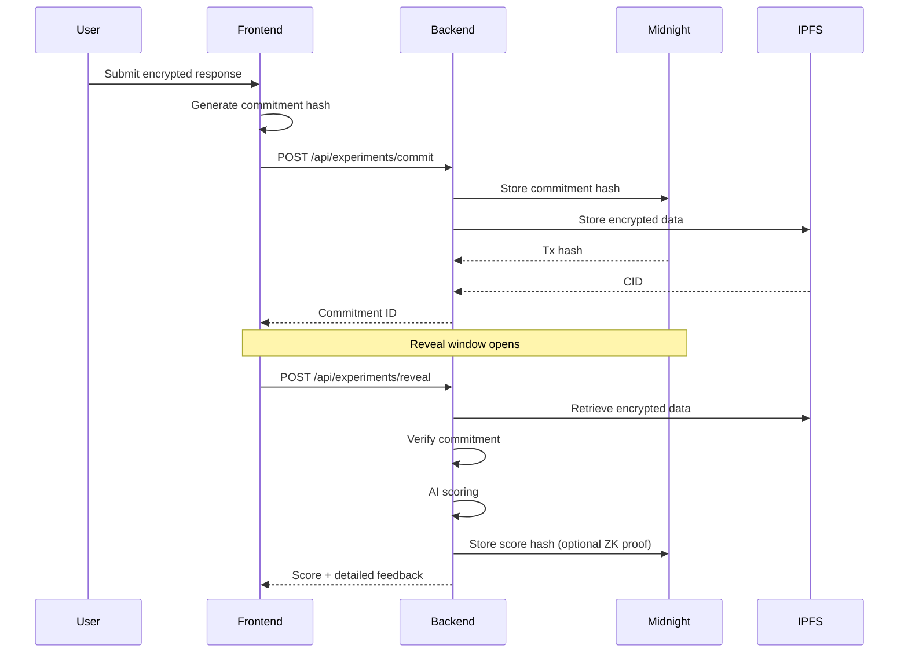

# Remote Viewing Protocols Specification

**Status**: Implementation Roadmap
**Last Updated**: 2025-10-06

---

## Overview

This document defines the standardized remote viewing (RV) protocols supported by Cognis Institute. Each protocol represents a distinct methodology developed and validated by the remote viewing community, with specific procedures, data collection requirements, and evaluation criteria.

---

## Protocol Catalog

### 1. Controlled Remote Viewing (CRV)

**Description**: Structured six-stage protocol developed by Ingo Swann for military intelligence applications. Uses ideograms and progressive refinement.

**AI Support**: Full (semantic analysis, stage progression validation)

**Data Fields**:
```json
{
  "stage1_ideograms": ["string"],
  "stage2_sensory": {
    "visual": ["string"],
    "auditory": ["string"],
    "tactile": ["string"],
    "olfactory": ["string"],
    "gustatory": ["string"]
  },
  "stage3_dimensional": {
    "size": "string",
    "shape": "string",
    "colors": ["string"],
    "textures": ["string"]
  },
  "stage4_analogies": ["string"],
  "stage5_aesthetics": {
    "emotional_impact": "string",
    "associations": ["string"]
  },
  "stage6_modeling": {
    "sketch": "base64_image",
    "3d_description": "string"
  }
}
```

**Evaluation Metrics**:
- **Ideogram accuracy**: Embedding similarity to target keywords
- **Sensory hit rate**: Percentage of correct sensory descriptors
- **Dimensional accuracy**: Shape/size/color matching score
- **Analogy relevance**: Semantic similarity to target attributes
- **Overall coherence**: Cross-stage consistency score

**Public Stats**: Hit rate by stage, average accuracy, completion rate
**Private Detailed Scoring**: Per-stage feedback, improvement suggestions

**UX Notes**:
- Guided stage-by-stage interface with timer
- Visual feedback after each stage completion
- Optional practice mode with known targets

---

### 2. Extended Remote Viewing (ERV)

**Description**: Relaxed, narrative-based protocol emphasizing altered states and free-flowing descriptions. Less structured than CRV.

**AI Support**: Full (narrative analysis, keyword extraction)

**Data Fields**:
```json
{
  "session_duration": "number (minutes)",
  "narrative": "string",
  "extracted_keywords": ["string"],
  "sketches": ["base64_image"],
  "confidence_ratings": {
    "overall": "number (1-10)",
    "per_element": {
      "keyword": "number (1-10)"
    }
  }
}
```

**Evaluation Metrics**:
- **Keyword match rate**: Percentage of keywords matching target description
- **Semantic coherence**: Embedding similarity between narrative and target
- **Sketch accuracy**: Image similarity (if applicable)
- **Confidence calibration**: Correlation between confidence and accuracy

**Public Stats**: Average narrative length, keyword hit rate, confidence distribution
**Private Detailed Scoring**: Highlighted matches, narrative coherence feedback

**UX Notes**:
- Relaxing background music/ambiance
- Voice-to-text option for narrative recording
- Minimal interruptions during session

---

### 3. Associative Remote Viewing (ARV)

**Description**: Precognitive protocol using associated targets to predict future binary outcomes (e.g., stock market movements).

**AI Support**: Partial (association matching only; future validation requires external data)

**Data Fields**:
```json
{
  "prediction_date": "ISO_8601_datetime",
  "target_A_description": "string",
  "target_B_description": "string",
  "prediction": "A | B",
  "confidence": "number (1-10)",
  "viewing_notes": "string"
}
```

**Evaluation Metrics**:
- **Prediction accuracy**: Binary hit/miss (validated after event)
- **Confidence calibration**: Does confidence predict accuracy?
- **Description quality**: Richness and specificity of target descriptions

**Public Stats**: Overall hit rate, confidence distribution
**Private Detailed Scoring**: Individual prediction outcomes, temporal analysis

**UX Notes**:
- Clear visual distinction between Target A and Target B
- Calendar interface for prediction date selection
- Post-event feedback notification system

---

### 4. High-Resolution Visual Geometry (HRVG)

**Description**: Real-time protocol where viewer sketches impressions while target is simultaneously generated/revealed elsewhere.

**AI Support**: Full (real-time sketch comparison, geometric analysis)

**Data Fields**:
```json
{
  "sketches": [
    {
      "timestamp": "ISO_8601_datetime",
      "sketch_data": "base64_image",
      "elapsed_seconds": "number"
    }
  ],
  "session_duration": "number (seconds)",
  "target_revealed_at": "ISO_8601_datetime"
}
```

**Evaluation Metrics**:
- **Geometric similarity**: Shape matching score
- **Temporal analysis**: Sketch quality over time
- **Feature correspondence**: Matched elements (lines, angles, proportions)

**Public Stats**: Average geometric similarity, session duration distribution
**Private Detailed Scoring**: Overlay comparison, highlighted feature matches

**UX Notes**:
- Canvas drawing interface with timestamp tracking
- 30-second session timer
- Optional pressure sensitivity for stylus input
- Real-time saving (no submit button needed)

---

### 5. Outbounder Protocol

**Description**: Two-person protocol where one person visits a remote location while the other attempts to describe it in real-time.

**AI Support**: Partial (description analysis; requires partner coordination)

**Data Fields**:
```json
{
  "viewer_id": "string",
  "outbounder_id": "string",
  "session_start": "ISO_8601_datetime",
  "session_end": "ISO_8601_datetime",
  "viewer_description": "string",
  "viewer_sketches": ["base64_image"],
  "outbounder_location": {
    "name": "string",
    "photos": ["base64_image"],
    "description": "string",
    "coordinates": {
      "lat": "number",
      "lon": "number"
    }
  }
}
```

**Evaluation Metrics**:
- **Description accuracy**: Semantic similarity to location description
- **Visual correspondence**: Sketch-to-photo similarity
- **Temporal synchronization**: Accuracy of real-time impressions

**Public Stats**: Partner success rate, session timing statistics
**Private Detailed Scoring**: Detailed comparison, missed vs. accurate elements

**UX Notes**:
- Partner matching/invitation system
- Synchronized session timer for both participants
- Location verification (GPS + photo upload for outbounder)
- Chat or audio link for post-session discussion

---

### 6. Ganzfeld Protocol

**Description**: Sensory deprivation protocol using white noise and visual occlusion to induce altered states conducive to psi.

**AI Support**: Manual review (subjective impressions difficult to automate)

**Data Fields**:
```json
{
  "session_duration": "number (minutes)",
  "audio_type": "white_noise | pink_noise | nature_sounds",
  "visual_occlusion": "red_light | ping_pong_balls | eye_mask",
  "transcript": "string",
  "timestamps": [
    {
      "time": "number (seconds)",
      "impression": "string"
    }
  ],
  "post_session_sketch": "base64_image"
}
```

**Evaluation Metrics**:
- **Manual judging**: Human expert rates similarity (1-7 scale)
- **Keyword extraction**: AI-assisted preliminary scoring
- **Impression richness**: Word count, imagery vividness

**Public Stats**: Average session duration, manual rating distribution
**Private Detailed Scoring**: Judge feedback, highlighted strong impressions

**UX Notes**:
- Audio playback system (white/pink noise)
- Voice recording with automatic transcription
- Relaxation timer (standard 30 minutes)
- Post-session sketch interface
- Warning: Not suitable for users with anxiety/claustrophobia

---

## Implementation Priority

### Phase 1: Foundation (Current - 1-2 weeks)
- ✅ Remote Viewing - Images (already working)
- ⏳ Remote Viewing - Events (similar structure to images)

### Phase 2: AI-Enhanced Protocols (1-2 months)
- **CRV Protocol**: Requires Python AI service for semantic analysis
- **ERV Protocol**: Similar AI requirements, narrative processing

### Phase 3: Real-Time & Advanced (3-6 months)
- **HRVG Protocol**: Needs WebSocket infrastructure for real-time sketch sync
- **Ganzfeld Protocol**: Requires audio playback and transcription system

### Phase 4: Future Extensions
- **ARV Protocol**: Needs external event validation mechanism
- **Outbounder Protocol**: Requires partner matching and GPS verification

---

## Technical Implementation Notes

### Database Schema Extension

```prisma
model Response {
  id              String   @id @default(cuid())
  commitmentId    String
  responseType    String
  responseData    Json

  // Protocol-specific fields
  protocol        String?
  ideograms       Json?    // For CRV stage 1
  sensoryData     Json?    // For CRV stage 2
  dimensionalData Json?    // For CRV stage 3
  analogies       Json?    // For CRV stage 4
  aesthetics      Json?    // For CRV stage 5
  modeling        Json?    // For CRV stage 6

  narrative       String?  // For ERV
  sketches        Json?    // For HRVG, ERV, Ganzfeld

  partnerId       String?  // For Outbounder
  locationData    Json?    // For Outbounder

  audioType       String?  // For Ganzfeld
  transcript      String?  // For Ganzfeld

  // Metadata
  sessionDuration Int?
  confidence      Float?

  // Existing fields
  revealedAt      DateTime?
  decryptedData   String?
  verifiedReveal  Boolean  @default(false)
  aiScore         Float?
  aiScoreBreakdown Json?

  commitment      Commitment @relation(fields: [commitmentId], references: [id])

  @@index([protocol])
  @@index([commitmentId])
}
```

### AI Service Architecture

```python
# ai/scoring/protocols/crv_scorer.py
from typing import Dict, List
from sentence_transformers import SentenceTransformer

class CRVScorer:
    def __init__(self):
        self.model = SentenceTransformer('all-MiniLM-L6-v2')

    async def score_stage1_ideograms(
        self,
        ideograms: List[str],
        target: Dict
    ) -> Dict:
        """Score ideogram accuracy using semantic embeddings"""
        target_keywords = self._extract_target_keywords(target)
        target_embedding = self.model.encode(target_keywords)
        ideogram_embeddings = self.model.encode(ideograms)

        similarities = cosine_similarity(
            ideogram_embeddings,
            [target_embedding]
        )

        return {
            "accuracy": float(similarities.mean()),
            "hits": self._identify_hits(ideograms, target_keywords),
            "misses": self._identify_misses(ideograms, target_keywords)
        }

    async def score_full_session(
        self,
        response_data: Dict,
        target: Dict
    ) -> Dict:
        """Score all six CRV stages"""
        stage_scores = {}

        # Stage 1: Ideograms
        stage_scores['stage1'] = await self.score_stage1_ideograms(
            response_data['stage1_ideograms'],
            target
        )

        # Stage 2: Sensory descriptors
        stage_scores['stage2'] = await self.score_sensory_data(
            response_data['stage2_sensory'],
            target
        )

        # ... stages 3-6

        return {
            "overall_score": self._calculate_weighted_score(stage_scores),
            "stage_breakdown": stage_scores,
            "strengths": self._identify_strengths(stage_scores),
            "areas_for_improvement": self._suggest_improvements(stage_scores)
        }
```

### WebSocket Infrastructure (HRVG)

```typescript
// backend/services/websocket/hrvg.ts
import { Server, Socket } from 'socket.io';

export class HRVGSessionManager {
  private activeSessions: Map<string, HRVGSession> = new Map();

  handleConnection(socket: Socket) {
    socket.on('hrvg:start', async ({ commitmentId, userId }) => {
      const session = new HRVGSession(commitmentId, userId);
      this.activeSessions.set(commitmentId, session);

      // Start 30-second timer
      session.startTimer(() => {
        socket.emit('hrvg:time-up', { commitmentId });
        this.finalizeSession(commitmentId);
      });

      socket.emit('hrvg:started', {
        sessionId: commitmentId,
        duration: 30
      });
    });

    socket.on('hrvg:sketch-update', async ({ commitmentId, sketchData }) => {
      const session = this.activeSessions.get(commitmentId);
      if (session) {
        session.addSketch({
          timestamp: new Date().toISOString(),
          sketchData,
          elapsedSeconds: session.getElapsedTime()
        });
      }
    });
  }

  private async finalizeSession(commitmentId: string) {
    const session = this.activeSessions.get(commitmentId);
    if (session) {
      await session.save();
      this.activeSessions.delete(commitmentId);
    }
  }
}
```

### Audio System (Ganzfeld)

```typescript
// web/src/utils/audio/ganzfeld.ts
export class GanzfeldAudioGenerator {
  private audioContext: AudioContext;
  private noiseNode: AudioBufferSourceNode | null = null;

  constructor() {
    this.audioContext = new AudioContext();
  }

  generateWhiteNoise(): void {
    const bufferSize = this.audioContext.sampleRate * 2; // 2 seconds
    const buffer = this.audioContext.createBuffer(
      2, // stereo
      bufferSize,
      this.audioContext.sampleRate
    );

    // Fill with random values
    for (let channel = 0; channel < 2; channel++) {
      const data = buffer.getChannelData(channel);
      for (let i = 0; i < bufferSize; i++) {
        data[i] = Math.random() * 2 - 1; // Range: -1 to 1
      }
    }

    this.noiseNode = this.audioContext.createBufferSource();
    this.noiseNode.buffer = buffer;
    this.noiseNode.loop = true;
    this.noiseNode.connect(this.audioContext.destination);
  }

  start(): void {
    if (this.noiseNode) {
      this.noiseNode.start(0);
    }
  }

  stop(): void {
    if (this.noiseNode) {
      this.noiseNode.stop();
      this.noiseNode = null;
    }
  }
}
```

---

## User Experience Design

### Protocol Selection Interface

Organize protocols by difficulty/experience level:

**🌱 Beginner**:
- Remote Viewing - Images (visual, immediate feedback)
- ERV Protocol (relaxed, narrative)

**🌿 Intermediate**:
- Remote Viewing - Events (temporal complexity)
- CRV Protocol (structured stages)

**🌳 Advanced**:
- HRVG Protocol (real-time pressure)
- Ganzfeld Protocol (altered states)

**🏆 Expert**:
- ARV Protocol (precognition)
- Outbounder Protocol (coordination)

### Experiment Flow Template

```typescript
// Generic protocol flow
interface ProtocolFlow {
  // 1. Setup
  setup: {
    instructions: string;
    estimatedDuration: number;
    requiredPermissions?: string[];
    warnings?: string[];
  };

  // 2. Pre-session
  preSession?: {
    calibration?: () => Promise<void>;
    meditation?: { duration: number };
  };

  // 3. Active session
  session: {
    stages: Stage[];
    realTime: boolean;
    partnerRequired: boolean;
  };

  // 4. Post-session
  postSession?: {
    cooldown?: { duration: number };
    sketch?: boolean;
    feedback?: boolean;
  };

  // 5. Scoring
  scoring: {
    immediate: boolean;
    aiSupport: 'full' | 'partial' | 'manual';
    publicStats: string[];
    privateStats: string[];
  };
}
```

---

## Privacy & Data Integrity

All protocols must adhere to CLAUDE.md requirements:

### Client-Side Encryption
```typescript
// Before submission
const encryptedResponse = await encryptionService.encrypt(
  responseData,
  ephemeralKey
);

const commitment = await experimentService.createCommitment({
  experimentType: protocol,
  encryptedData: encryptedResponse,
  // ... metadata
});
```

### Commit-Reveal Flow


### Differential Privacy for Aggregates

```python
# ai/privacy/differential_privacy.py
from typing import List
import numpy as np

def add_laplace_noise(
    value: float,
    epsilon: float = 1.0,
    sensitivity: float = 1.0
) -> float:
    """Add Laplace noise for differential privacy"""
    scale = sensitivity / epsilon
    noise = np.random.laplace(0, scale)
    return value + noise

def anonymize_aggregate_stats(
    scores: List[float],
    epsilon: float = 1.0
) -> Dict:
    """Compute differentially private aggregate statistics"""
    mean_score = np.mean(scores)
    std_score = np.std(scores)

    return {
        "mean": add_laplace_noise(mean_score, epsilon),
        "std": add_laplace_noise(std_score, epsilon),
        "count": len(scores)  # Count is safe to publish
    }
```

---

## Evaluation & Validation

### Scoring Rubric Template

Each protocol must define:

1. **Quantitative Metrics**: Numeric scores (0-100 scale)
2. **Qualitative Feedback**: Strengths, weaknesses, suggestions
3. **Statistical Context**: Percentile rank, baseline comparison
4. **Trend Analysis**: Performance over time (private only)

### Example: CRV Scoring Output

```json
{
  "overall_score": 72.5,
  "percentile_rank": 68,
  "stage_breakdown": {
    "stage1_ideograms": {
      "score": 85,
      "hits": ["water", "rectangular structure"],
      "misses": ["organic shapes"]
    },
    "stage2_sensory": {
      "score": 70,
      "hits": ["cool temperature", "sound of movement"],
      "misses": ["visual descriptors too vague"]
    },
    "stage3_dimensional": {
      "score": 65,
      "hits": ["approximately correct size"],
      "misses": ["color inaccurate"]
    }
  },
  "strengths": [
    "Strong ideogram phase - good intuitive hit rate",
    "Sensory impressions align well with target"
  ],
  "areas_for_improvement": [
    "Dimensional accuracy could improve with more practice",
    "Try spending more time in stage 3 before moving forward"
  ],
  "baseline_comparison": {
    "your_score": 72.5,
    "chance_expected": 25.0,
    "expert_average": 78.0
  },
  "trend": {
    "last_5_sessions": [65, 68, 70, 71, 72.5],
    "improvement_rate": "+2.3 points/session"
  }
}
```

---

## Research & Scientific Rigor

### Meta-Analysis Agent (Future)

```python
# ai/agents/meta_analysis.py
class MetaAnalysisAgent:
    """Aggregate results across protocols for research insights"""

    async def analyze_protocol_effectiveness(
        self,
        protocol: str
    ) -> MetaAnalysisReport:
        """Compare protocol to baseline and other protocols"""

        responses = await self.get_protocol_responses(protocol)

        # Calculate effect size
        effect_size = self.calculate_cohens_d(
            responses.scores,
            baseline_mean=25.0,  # Chance expectation
            baseline_std=10.0
        )

        # Statistical significance
        p_value = self.t_test(responses.scores, baseline_mean=25.0)

        # Replication analysis
        replication_rate = self.check_replicability(responses)

        return MetaAnalysisReport(
            protocol=protocol,
            n_sessions=len(responses),
            mean_score=np.mean(responses.scores),
            effect_size=effect_size,
            p_value=p_value,
            replication_rate=replication_rate,
            significant=p_value < 0.05 and effect_size > 0.3
        )
```

### Preregistration System (Future)

Allow researchers to preregister hypotheses before conducting experiments:

```typescript
interface PreregisteredStudy {
  id: string;
  researcher: string;
  hypothesis: string;
  protocol: string;
  targetSampleSize: number;
  analysisplan: string;
  registeredAt: Date;
  completedAt?: Date;
  results?: MetaAnalysisReport;
}
```

---

## References

- **CRV**: Swann, I. (1989). *Coordinate Remote Viewing Stages I-VI*
- **ERV**: McMoneagle, J. (1993). *Mind Trek: Exploring Consciousness, Time, and Space Through Remote Viewing*
- **ARV**: Targ, R. (2012). *The Reality of ESP: A Physicist's Proof of Psychic Abilities*
- **Ganzfeld**: Honorton, C. (1985). *Meta-analysis of psi Ganzfeld research*
- **HRVG**: Katra, J., & Targ, R. (1999). *The Heart of the Mind*

---

## Next Steps

1. ✅ **Save this specification** as implementation reference
2. ⏳ **Test current RV system** thoroughly with real users
3. ⏳ **Add Remote Viewing - Events** (low complexity extension)
4. ⏳ **Build Python AI microservice** for semantic analysis
5. ⏳ **Implement CRV protocol** as first advanced protocol

---

**Note**: This is a living document. Update as protocols are implemented and refined based on user feedback and scientific validation.
