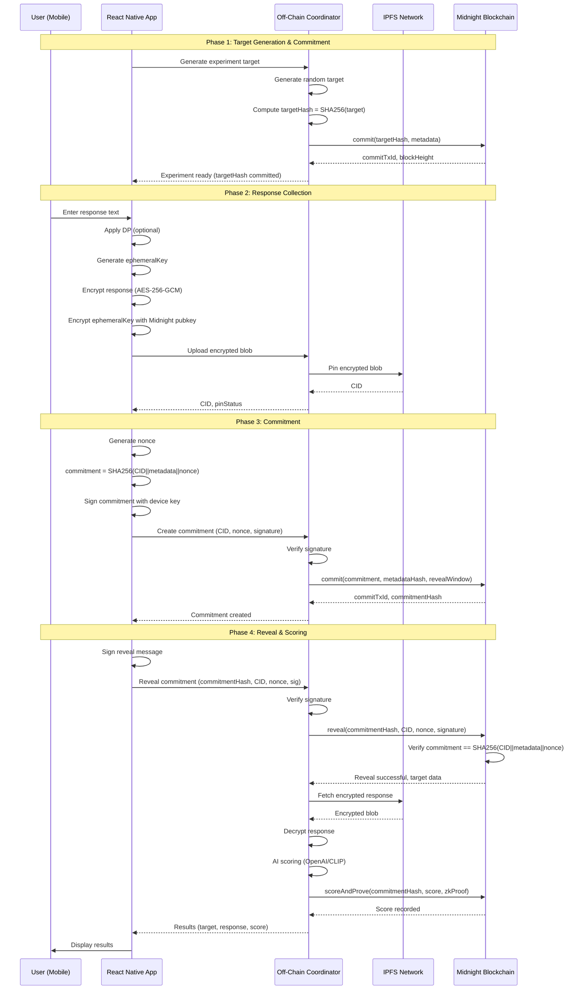

# Midnight Blockchain Integration

## Overview

Cognosis uses Midnight blockchain for privacy-preserving commit/reveal protocol with zero-knowledge proofs. This document explains the integration architecture, data flow, and implementation details.

## Architecture

```
┌─────────────────────────────────────────────────────────────────┐
│                       React Native Client                        │
│  ┌──────────────┐  ┌──────────────┐  ┌─────────────────────┐  │
│  │ usePsiTrial  │→ │  Encryption  │→ │  Device Signature   │  │
│  │     Hook     │  │  (AES-GCM)   │  │   (Wallet Sign)     │  │
│  └──────────────┘  └──────────────┘  └─────────────────────┘  │
└─────────────────────────────┬───────────────────────────────────┘
                              │ HTTPS
                              ▼
┌─────────────────────────────────────────────────────────────────┐
│                    Off-Chain Coordinator (Node.js)               │
│  ┌──────────────┐  ┌──────────────┐  ┌─────────────────────┐  │
│  │ IPFS Helper  │  │ Signature    │  │  Midnight SDK       │  │
│  │   (Pinata)   │  │ Verification │  │  DApp Connector     │  │
│  └──────────────┘  └──────────────┘  └─────────────────────┘  │
└─────────────────────────────┬───────────────────────────────────┘
                              │ RPC
                              ▼
┌─────────────────────────────────────────────────────────────────┐
│                    Midnight Blockchain (Testnet)                 │
│  ┌──────────────┐  ┌──────────────┐  ┌─────────────────────┐  │
│  │   Compact    │  │ Confidential │  │   ZK Prover         │  │
│  │  Contract    │  │    State     │  │   Service           │  │
│  └──────────────┘  └──────────────┘  └─────────────────────┘  │
└─────────────────────────────────────────────────────────────────┘
                              │
                              ▼
                    ┌─────────────────┐
                    │  IPFS Network   │
                    │  (Encrypted     │
                    │   Responses)    │
                    └─────────────────┘
```

## Commit/Reveal Flow

### Sequence Diagram



## Data Structures

### Commitment Record (On-Chain)

```typescript
interface CommitmentRecord {
  commitmentHash: Bytes32;          // SHA256(CID||metadata||nonce)
  metadataHash: Bytes32;             // SHA256(metadata)
  participant: PublicKey;            // User's public key
  revealWindow: Uint256;             // Block height when reveal is allowed
  accessPolicy: AccessPolicy;        // Who can read this commitment
  timestamp: Uint256;                // Block timestamp
  revealed: boolean;                 // Has been revealed?
  revealedCID: string;              // IPFS CID (after reveal)
  revealedNonce: Bytes32;           // Nonce (after reveal)
  scoreProofId: Bytes32;            // ZK proof ID (after scoring)
}
```

### Access Policy

```typescript
interface AccessPolicy {
  publicRead: boolean;               // Can anyone read?
  authorizedKeys: PublicKey[];       // Authorized readers
  requireProof: boolean;             // Require ZK proof for access?
}
```

### Encrypted Payload (IPFS)

```json
{
  "ciphertext": "base64-encoded-encrypted-data",
  "iv": "hex-initialization-vector",
  "algorithm": "AES-256-GCM",
  "encryptedKey": "ephemeral-key-encrypted-with-midnight-pubkey",
  "metadata": {
    "experimentType": "remote_viewing",
    "timestamp": 1234567890,
    "dpApplied": true,
    "epsilon": 1.0,
    "delta": 1e-5
  }
}
```

## Cryptographic Operations

### 1. Commitment Computation

```javascript
// Client-side
const commitment = SHA256(
  CID +
  JSON.stringify(metadata) +
  nonce
);
```

**Properties:**
- Binding: Cannot change CID/metadata/nonce after commitment
- Hiding: Commitment reveals nothing about contents
- Verifiable: Can prove commitment matches reveal

### 2. Response Encryption

```javascript
// Client-side encryption flow
const ephemeralKey = generateRandomBytes(32);  // 256-bit AES key
const iv = generateRandomBytes(16);            // 128-bit IV

const encrypted = AES_256_GCM_Encrypt(
  plaintext: responseText,
  key: ephemeralKey,
  iv: iv
);

const encryptedKey = MidnightPublicKeyEncrypt(
  plaintext: ephemeralKey,
  publicKey: midnightNetworkPubKey
);

// Upload to IPFS
const payload = {
  ciphertext: encrypted,
  iv: iv,
  encryptedKey: encryptedKey,
  algorithm: 'AES-256-GCM'
};
```

### 3. Device Signature

```javascript
// Sign commitment for authentication
const message = commitmentHash + CID + nonce;
const signature = Sign(
  message: message,
  privateKey: devicePrivateKey
);

// Server verifies
const isValid = Verify(
  message: message,
  signature: signature,
  publicKey: devicePublicKey
);
```

## Zero-Knowledge Proofs

### Proof Types

#### 1. Differential Privacy Attestation

**Purpose:** Prove that local DP noise was correctly applied without revealing the noise value.

**Public Inputs:**
- `epsilon` - Privacy budget
- `delta` - Failure probability
- `mechanism` - DP mechanism (Laplace/Gaussian)
- `commitmentHash` - Commitment being proven

**Private Inputs:**
- `noiseValue` - Actual noise added
- `originalValue` - Pre-noise value
- `randomnessSeed` - Seed for noise generation

**Circuit:** Verifies that `noiseValue` was drawn from correct distribution with specified `epsilon`/`delta`.

**Usage:**
```javascript
const dpProof = await prover.generateDPAttestationProof({
  epsilon: 1.0,
  delta: 1e-5,
  mechanism: 'laplace',
  commitmentHash: commitmentHash,
  privateInputs: {
    noiseValue: 0.05,
    originalValue: 0.75,
    randomnessSeed: 'random-seed-123'
  }
});

// Submit to chain
await contract.scoreAndProve(
  commitmentHash,
  score,
  scoringModuleHash,
  zkProof,
  dpProof  // DP attestation
);
```

#### 2. Score Correctness Proof

**Purpose:** Prove that AI score was computed correctly according to specified algorithm.

**Public Inputs:**
- `commitmentHash` - Commitment being scored
- `cid` - IPFS CID of response
- `score` - Computed score (0-10000 basis points)
- `scoringModuleHash` - Hash of scoring algorithm version

**Private Inputs:**
- `responseText` - User's response
- `targetData` - Experiment target
- `embeddingModel` - AI model used

**Circuit:** Verifies that:
1. Correct embedding model was used
2. Correct similarity metric applied
3. Score matches computation

**Usage:**
```javascript
const scoreProof = await prover.generateScoreCorrectnessProof({
  commitmentHash: commitmentHash,
  cid: responseCID,
  score: 7500,  // 75.00%
  scoringModuleHash: 'hash-of-algo-v1',
  privateInputs: {
    responseText: 'mountains and water',
    targetData: 'image-of-lake.jpg',
    embeddingModel: 'text-embedding-3-small'
  }
});
```

#### 3. Equivalence Proof

**Purpose:** Prove that revealed value matches original commitment.

**Public Inputs:**
- `commitmentHash` - Original commitment
- `revealedValueHash` - Hash of revealed value

**Private Inputs:**
- `nonce` - Random nonce
- `revealedValue` - Actual revealed value
- `encryptionKey` - Encryption key (if applicable)

**Circuit:** Verifies that `SHA256(revealedValue||nonce) == commitmentHash`.

## Selective Disclosure

### Access Control Levels

1. **Public Read** (`publicRead: true`)
   - Anyone can query commitment
   - Basic info visible (hash, timestamp)
   - Response data still encrypted

2. **Private** (`publicRead: false`)
   - Only participant can read
   - Others get "Access Denied"

3. **Authorized Keys** (`authorizedKeys: [...]`)
   - Specific keys can read
   - Useful for researchers/auditors

4. **Proof Required** (`requireProof: true`)
   - Must provide ZK proof of authorization
   - Most privacy-preserving option

### Example

```javascript
const accessPolicy = {
  publicRead: false,
  authorizedKeys: [
    participantPubKey,
    researcherPubKey,
    auditorPubKey
  ],
  requireProof: false
};

await contract.commit(
  commitmentHash,
  metadataHash,
  revealWindow,
  accessPolicy
);
```

## Key Management

### Key Types

1. **Device Key Pair**
   - Generated on first app launch
   - Stored in secure storage (Keychain/Keystore)
   - Used for signing commitments/reveals

2. **Ephemeral Keys**
   - Generated per-trial
   - Used for AES encryption
   - Encrypted with Midnight network public key
   - Destroyed after use

3. **Midnight Network Public Key**
   - Hardcoded in app
   - Used to encrypt ephemeral keys
   - Allows Midnight network to decrypt for scoring

### Key Revocation

To revoke access to old data:

1. **Delete Ephemeral Keys**
   - Once ephemeral key is deleted, data is unrecoverable
   - Even if IPFS CID is known

2. **Rotate Device Key**
   - Generate new device key pair
   - Old commitments remain valid but unmodifiable

3. **Update Access Policy** (if supported)
   - Change `authorizedKeys` list
   - Requires on-chain transaction

## Privacy Model

### Threat Model

**Trusted:**
- Midnight blockchain validators (honest majority)
- Client device security
- IPFS network availability

**Untrusted:**
- Off-chain coordinator (semi-trusted)
- IPFS storage nodes
- Network observers
- Other app users

### Privacy Guarantees

1. **Response Confidentiality**
   - Encrypted client-side before upload
   - IPFS nodes see only ciphertext
   - Coordinator cannot decrypt without key

2. **Commitment Hiding**
   - Commitment reveals nothing about response
   - SHA256 preimage resistance

3. **Differential Privacy** (optional)
   - Local DP noise added before encryption
   - Global DP when aggregating statistics
   - ε-DP with provable ZK attestation

4. **Selective Disclosure**
   - Fine-grained access control
   - Proof-based authorization
   - Confidential state on Midnight

### Privacy Parameters

```javascript
// Differential Privacy
const dpParams = {
  epsilon: 1.0,        // Privacy budget (lower = more private)
  delta: 1e-5,         // Failure probability
  mechanism: 'laplace' // or 'gaussian'
};

// Access Control
const accessParams = {
  publicRead: false,
  requireProof: true,
  authorizedKeys: [trustedKeys]
};
```

## Error Handling

### Common Errors

| Error | Cause | Solution |
|-------|-------|----------|
| `Commitment already exists` | Duplicate commitment hash | Use unique nonce |
| `Reveal window not open` | Tried to reveal too early | Wait for reveal window |
| `Reveal does not match commitment` | CID/nonce mismatch | Verify correct data used |
| `Already revealed` | Double reveal attempt | Check reveal status first |
| `Invalid signature` | Wrong device key | Use correct signing key |
| `Access denied` | Unauthorized query | Check access policy |
| `Score out of range` | Invalid score value | Score must be 0-10000 |

### Retry Logic

```javascript
async function submitWithRetry(operation, maxRetries = 3) {
  for (let i = 0; i < maxRetries; i++) {
    try {
      return await operation();
    } catch (error) {
      if (i === maxRetries - 1) throw error;

      // Exponential backoff
      await sleep(Math.pow(2, i) * 1000);
    }
  }
}

// Usage
await submitWithRetry(() =>
  coordinator.createCommitment(cid, metadata, nonce, signature)
);
```

## Gas Optimization

### Estimated Gas Costs

| Operation | Gas (Testnet) | USD (est.) |
|-----------|---------------|------------|
| `commit()` | ~200,000 | $0.20 |
| `reveal()` | ~150,000 | $0.15 |
| `scoreAndProve()` | ~250,000 | $0.25 |
| `getCommitment()` | ~10,000 | $0.01 |

### Optimization Strategies

1. **Batch Operations**
   - Commit multiple experiments in one transaction
   - Reduce per-operation overhead

2. **Optimize Storage**
   - Store only hashes on-chain
   - Full data in IPFS

3. **Lazy Scoring**
   - Score on-demand rather than automatically
   - User pays gas only if they want score

## Monitoring & Observability

### Events to Monitor

```javascript
// Contract events
contract.on('CommitmentCreated', (commitmentHash, participant, timestamp) => {
  console.log(`New commitment: ${commitmentHash}`);
  metrics.increment('commitments.created');
});

contract.on('CommitmentRevealed', (commitmentHash, cid, timestamp) => {
  console.log(`Commitment revealed: ${commitmentHash}`);
  metrics.increment('commitments.revealed');
});

contract.on('ScoreProofSubmitted', (commitmentHash, score, proofId) => {
  console.log(`Score submitted: ${score} for ${commitmentHash}`);
  metrics.gauge('scores.average', score);
});
```

### Metrics to Track

- Commitments created per hour
- Reveal success rate
- Average time to reveal
- Score distribution
- Gas costs per operation
- IPFS pin success rate

## Testing

### Unit Tests
- `tests/test_ipfs_helper.js` - IPFS operations
- `tests/test_offchain_endpoints.js` - API endpoints

### Integration Tests
- `scripts/run_poc.sh` - End-to-end flow

### Contract Tests
- `tests/test_compact_sanity.md` - Contract operations

### Run All Tests

```bash
# Unit tests
npm test

# Integration test
./scripts/run_poc.sh

# Contract tests (requires deployed contract)
./tests/run_compact_tests.sh <contract-address>
```

## Production Checklist

- [ ] Deploy Compact contract to testnet
- [ ] Configure real Midnight SDK (not mock)
- [ ] Set up production IPFS pinning (Pinata/Blockfrost)
- [ ] Generate and secure Midnight API keys
- [ ] Enable HTTPS for coordinator
- [ ] Set up monitoring and alerts
- [ ] Configure backup/redundancy for coordinator
- [ ] Audit smart contract code
- [ ] Penetration test API endpoints
- [ ] Load test with realistic traffic
- [ ] Document incident response procedures

## Resources

- [Midnight Documentation](https://docs.midnight.network)
- [Compact Language Reference](https://docs.midnight.network/compact)
- [Midnight DApp Connector](https://docs.midnight.network/dapp-connector)
- [Zero-Knowledge Proofs in Midnight](https://docs.midnight.network/zk-proofs)

---

**Last Updated:** 2025-01-02
**Version:** 1.0.0
